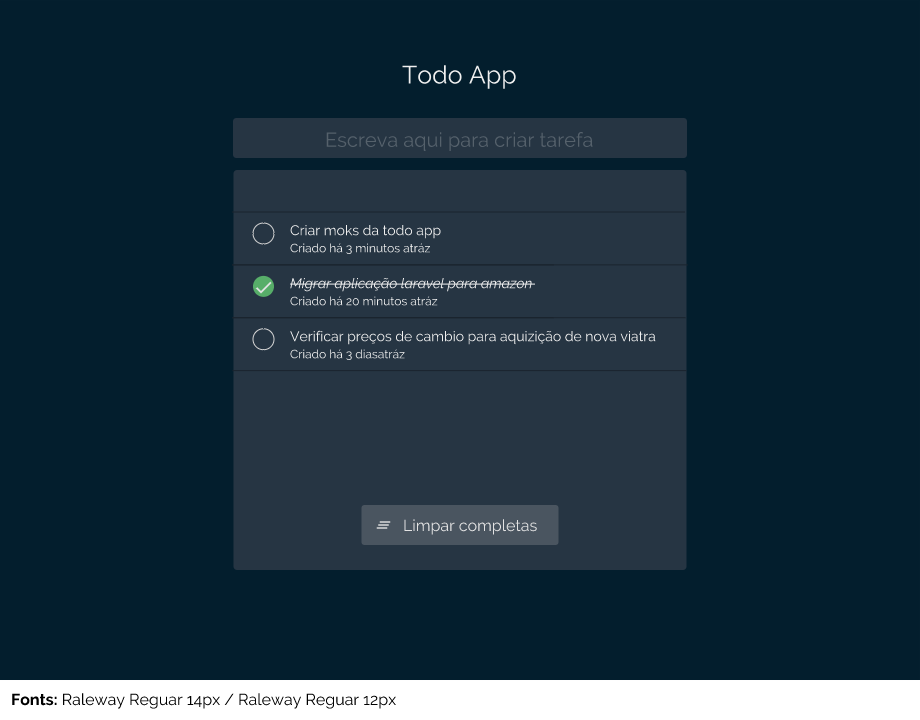

# Requirements
- Git
- NodeJS
- NPM/Yarn (Yarn is prefered)

# Instuctions
- Fork this repo
- Write the app using vue components and Vuex state management
- Use this poject's structure for development
- Follow the project coding style
- After finishing send your project by email to cdd@technoplus.co.mz with the following 
subject: Todo List Frontend Challenge - Your Name 

## Build Setup

``` bash
# install dependencies
npm install

# serve with hot reload at localhost:8080
npm run dev
```

# The problem
We have a little problem which is Task management.
So our company decided to build a simple todo so our co-workers can track what their are doing
with the following design 


 
## Functional requirements
- add todo
- mark todo as done or undone
- clear all todos marked as done

## Non functional requirements
- use the provided design
- to add todo users must use the input provided by the design and press enter
- to mark as done or undone users must click at the circle at the left corner of the todo
- all done todos should appear at the end of the list 
- it should be responsive so we can use on our smart phones
- use your creativity ;)


## Extra points
- Follow development best practices in vuejs development
- Do not use JQuery or any other libraries that are not necessary
- Use reusable components
- Document your code with comments
- Provide a better Design for the app
- Use Sass

For a detailed explanation on how things work, check out the [guide](http://vuejs-templates.github.io/webpack/) and [docs for vue-loader](http://vuejs.github.io/vue-loader).
